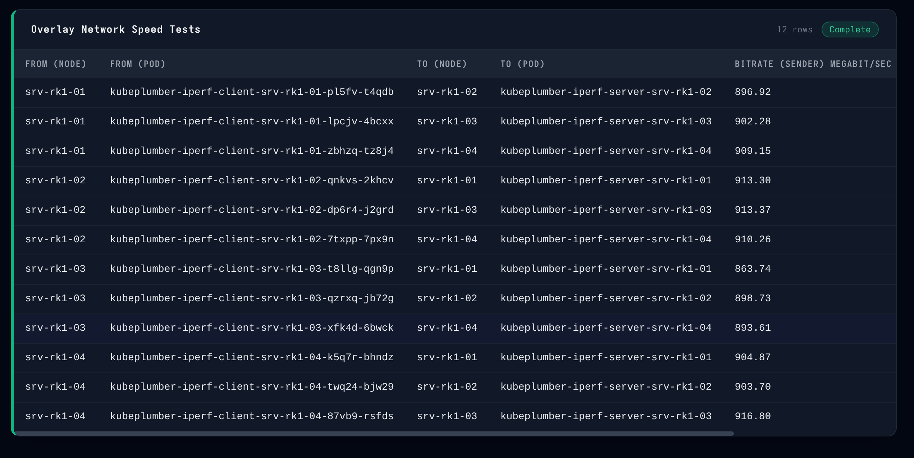
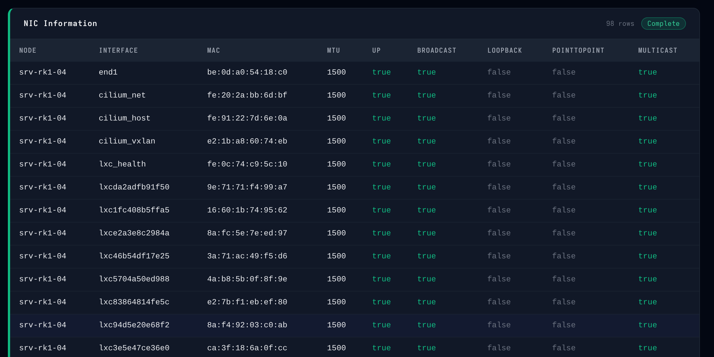
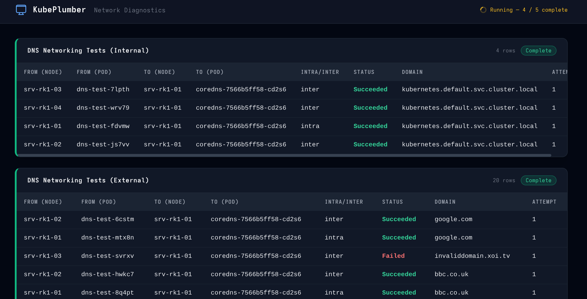

`KubePlumber` is a Kubernetes networking utility that validates/test network connectivity in a Kubernetes cluster, including:

* Internal DNS Resolution (Inter + Intra node)
* Internal traffic testing (Inter and Intra node)
* External DNS resolution
* Bandwidth Testing between nodes





## Example Usage

`kubeplumber --kubeconfig ~/.kube/config   --config config.yaml   --namespace default   --webport 8080`

An example [config.yaml](https://github.com/David-VTUK/KubePlumber/blob/main/config.yaml)

### Options

```bash
  --config string
        Path to the config file (default "config.yaml")
  --kubeconfig string
        (required) absolute path to the kubeconfig file
  --loglevel string
        Log level (info, info, warn, error, fatal, panic) (default "info")
  --namespace string
        Namespace to run tests in (default "default")
```
