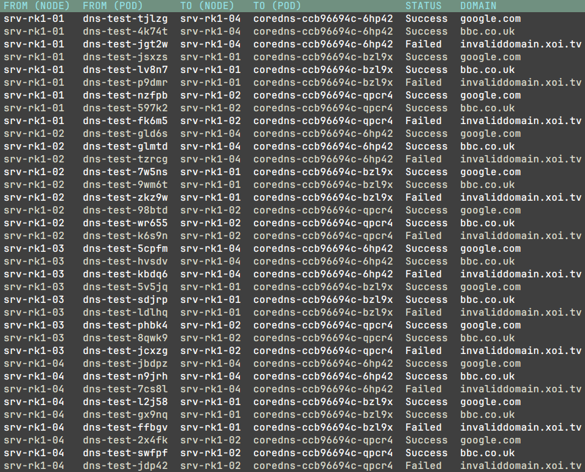

`KubePlumber` is a Kubernetes networking utility that validates/test network connectivity in a Kubernetes cluster, including:

* Internal DNS Resolution (Inter + Intra node)
* Internal traffic testing (Inter and Intra node)
* External DNS resolution

Future additions:

* MTU Validation between nodes
* Host NIC configuration




## Example Usage

`kubeplumber -kubeconfig ~/.kube/config -configFile config.yaml`

An example [config.yaml](https://github.com/David-VTUK/KubePlumber/blob/main/config.yaml)

### Options

```bash
  -config string
        Path to the config file (default "config.yaml")
  -kubeconfig string
        (required) absolute path to the kubeconfig file
  -loglevel string
        Log level (debug, info, warn, error, fatal, panic) (default "debug")
  -namespace string
        Namespace to run tests in (default "default")
```