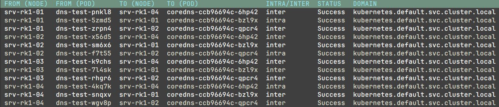

`KubePlumber` is a Kubernetes networking utility that validates/test network connectivity in a Kubernetes cluster, including:

* Internal DNS Resolution (Inter + Intra node)
* Internal traffic testing (Inter and Intra node)
* External DNS resolution
* MTU Validation between nodes
* Host NIC configuration

## Example Usage

For an OpenShift cluster:

`go run ./cmd/main.go -kubeconfig ~/.kube/config -dnsConfigMapName default -dnsConfigNamespace openshift-dns -isOpenShift true`

For a k3s/generic cluster

`go run ./cmd/main.go -kubeconfig ~/.kube/config`